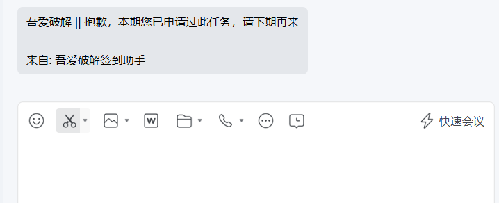
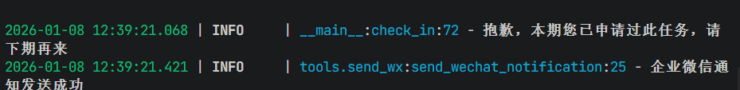
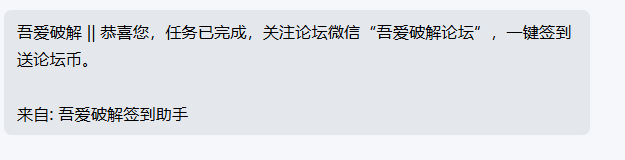
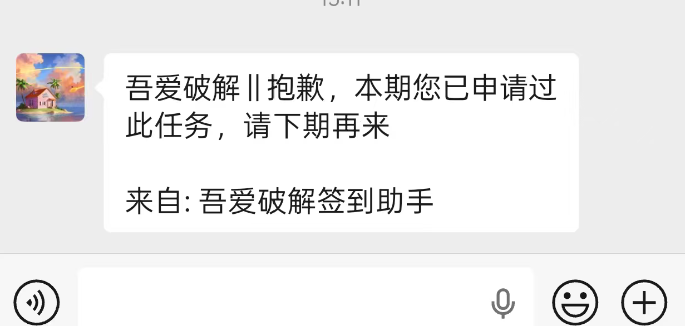

# 吾爱破解签到脚本

> 基于 pyexecjs 的吾爱破解论坛自动签到脚本

> 增加看雪论坛，MT论坛，精易论坛签到脚本（待合并）


## 📅 更新日期
*同一个IP，定时签到会被风控*

2026-01-16 （增加微信消息推送）

## ✨ 功能特性
- 🤖 自动签到吾爱破解论坛
- 📱 支持企业微信消息推送
- 📱 支持钉钉机器人消息推送
- 📱 支持微信消息推送
- 📱 支持代理IP
- ⏰ 支持定时签到（默认每天8:00，可在env配置cron定时表达式）
- 📦 轻量级设计，易于使用

## 📥 安装指南

### 1. 克隆仓库
```bash
git clone https://github.com/jwmycz/py52pojie.git
cd py52pojie
```

### 2. 安装依赖
```bash
pip install -r requirements.txt
```

## 🚀 使用说明

### 单次签到
```bash
python start.py start
```

### 定时签到
```bash
python start.py sch
```
> 定时签到默认每天早上8:00执行

## 📸 效果展示

### 企业微信消息示例


### 程序运行示例


### 签到完成示例


### 微信通知示例


## ⚙️ 配置说明

### 1. 更新 Cookie
1. 登录吾爱破解论坛
2. 获取 Cookie 信息
3. 编辑 `env/cookies.json` 文件，替换为你的 Cookie

### 2. 配置企业微信推送
1. 申请企业微信机器人
2. 获取 Webhook URL
3. 编辑 `env` 目录下的配置文件，将 `wechat_url` 替换为你的机器人 URL

### 3. 配置钉钉机器人推送
1. 申请钉钉机器人
2. 获取 Webhook URL
3. 编辑 `env` 目录下的配置文件，将 `dingding_url` 替换为你的机器人 URL

### 4. 配置代理IP
1. 申请代理商API
2. 在env文件中添加代理API
3. 修改proxy目录下pool文件的_refresh函数，需要根据不同的代理商api重写响应

### 5.微信通知配置
1. 基于`https://github.com/qingzhou-dev/push-server` 重写的python推送后端，需自行配置

## 📋 TODO 列表
- [x] 支持代理设置
- [ ] 添加更多推送方式（Telegram 等）
- [x] 增加签到日志记录（日志保存在 log 文件中）
- [ ] 支持多账号签到
- [ ] 支持看雪乱弹签到
- [ ] 支持MT论坛签到
- [ ] 支持精易论坛签到

## 📝 注意事项
1. 请确保你的 Cookie 信息正确且未过期
2. 请勿频繁运行脚本，避免被论坛封禁
3. 定时签到功能依赖系统的任务调度，请确保脚本有足够的运行权限
4. 企业微信推送功能需要正确配置 Webhook URL
5. dingding推送功能需要正确配置 Webhook URL
6. **代理功能如果是不同的代理商一定要重写响应**
7. **微信推送需要自行部署后端**
## 📝 更新记录

| 日期         | 更新内容                      |
|------------|---------------------------|
| 2026-01-10 | 变更定时任务为cron表达式,增加企业微信开关配置 |
| 2026-01-14 | 增加钉钉机器人推送                 |
| 2026-01-15 | 增加代理配置                    |
| 2026-01-16 | 增加微信推送配置                  |
## 📄 许可证
MIT License

## 🤝 贡献
欢迎提交 Issue 和 Pull Request！

## 📧 联系方式
如有问题或建议，欢迎联系开发者。

